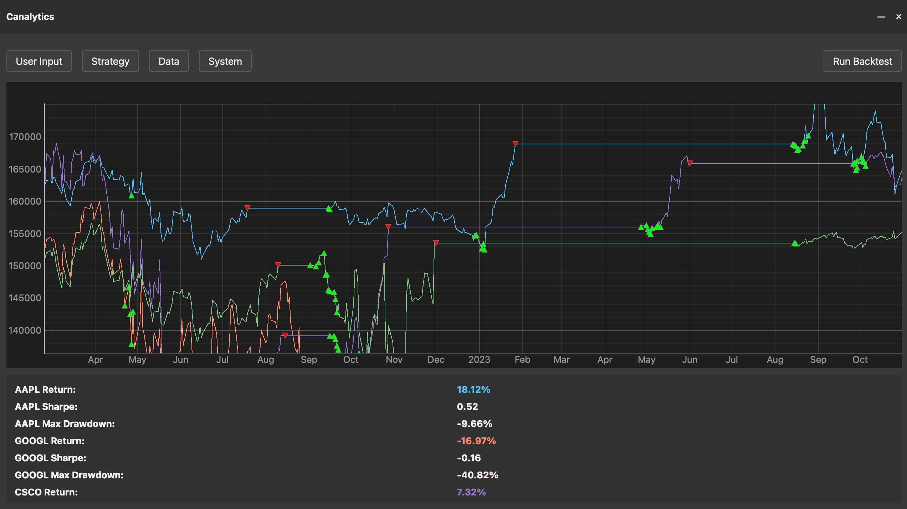

# Canalytics Strategy Backtester

**Canalytics** is a flexible backtesting engine built to evaluate algorithmic trading strategies across multiple stock tickers using preset or custom strategies. It's designed for traders and developers who want clear performance insights and modular extensibility.

## Core Features

- 📈 **Multi-Ticker Support**  
  Backtest across an array of stock tickers simultaneously.

- 🧠 **Built-In & Custom Strategies**  
  Choose from a variety of preset strategies (e.g., Moving Average Crossover, RSI-based entry/exit) or import your own custom strategy module.

- 📊 **Results Dashboard**  
  Visualize key metrics like total return, Sharpe ratio, max drawdown, and win/loss ratio. Results can be exported as `.txt` or `.json`.

- 🗂️ **Flexible Data Sources**  
  Choose your data provider:
  - `yfinance` (default)
  - Import Custom API service
  - Local `.csv` file import

## Stretch Goals

- 🤖 **LLM Chatbot Assistant**  
  Analyze and interpret backtest results using an AI chatbot (e.g., GPT-based).

- 🧪 **Strategy Optimization Engine**  
  Automated hyperparameter tuning for strategies (grid/random search).

- 💾 **Strategy Library Sync**  
  Share and sync strategy files across teams or cloud storage.

- 📅 **Scheduled Replays**  
  Set up time-based replay simulations using historical intervals.